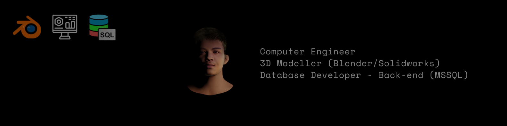

<!--
**davdavid29/davdavid29** is a ✨ _special_ ✨ repository because its `README.md` (this file) appears on your GitHub profile.

Here are some ideas to get you started:

- 🔭 I’m currently working on ...
- 🌱 I’m currently learning ...
- 👯 I’m looking to collaborate on ...
- 🤔 I’m looking for help with ...
- 💬 Ask me about ...
- 📫 How to reach me: ...
- 😄 Pronouns: ...
- ⚡ Fun fact: ...
-->

# Introducing Myself

Hi! I'm Maverick, I'm a career-oriented person who loves pushing myself to be the best professional I can be. I'm always looking for new opportunities and challenges to grow in my field. As a data focused professional (data driven) with strong problem solving skills and experience in designing and building large scale data platforms and analytics solutions, I am dedicated to delivering results through meticulous attention to detail and strong communication skills. A basic background on cloud computing and experience in designing and implementing cloud-based solutions for data management and analytics. I am excited about the opportunity to be involved in the development of enterprise-biased solutions and am always looking for ways to improve and grow in my field.

## Welcome to my portfolio!  

  

### Table of contents
* [Projects](https://github.com/davdavid29/Projects-Overview)
* [Professional Trainings and Certifications](https://github.com/davdavid29/Trainings-and-Certifications)
* [Skills & Technologies](#skills-&-technologies)

### Skills & Technologies
* SQL Querying (T-SQL, MySQL, Oracle SQL, PostgreSQL)
* Microsoft Business Intelligence (SSIS, SSAS, SSRS)
* Proficiency in C, Java, C++, VB.NET, Python
* Data Visualization (MATLAB)
* Data Engineering Background (Data Integration(ETL))
* MS office proficiency (Word, PPT, Excel, Outlook, SharePoint)
* Clients Support (Written Communication)
* Cloud Background (Amazon Web Services, MS Azure)
* Database (Developing, Administrating, Troubleshooting)
* Adaptability
* Team player
* Building PC (Installing Hardware, Software and OS)
