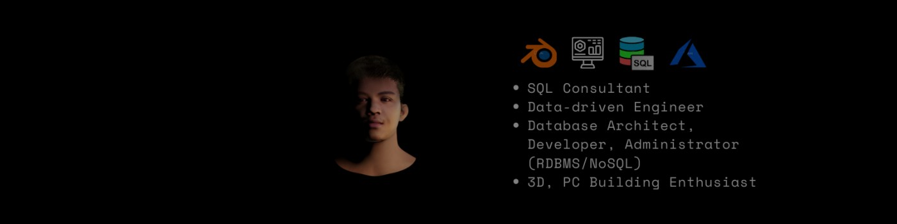

<!--
**davdavid29/davdavid29** is a ✨ _special_ ✨ repository because its `README.md` (this file) appears on your GitHub profile.

Here are some ideas to get you started:

- 🔭 I’m currently working on ...
- 🌱 I’m currently learning ...
- 👯 I’m looking to collaborate on ...
- 🤔 I’m looking for help with ...
- 💬 Ask me about ...
- 📫 How to reach me: ...
- 😄 Pronouns: ...
- ⚡ Fun fact: ...
-->

# Introducing Myself

# Hi there! 👋

I'm Maverick, a **SQL Developer** based in the Philippines. I specialize in software and data engineering and I'm passionate about building high-quality software that solves real-world problems.

I'm a career-oriented person who loves pushing myself to be the best professional I can be. I'm always looking for new opportunities and challenges to grow in my field. As a data focused professional (data driven) with strong problem solving skills and experience in designing and building large scale data platforms and analytics solutions, I am dedicated to delivering results through meticulous attention to detail and strong communication skills. A basic background on cloud computing and experience in designing and implementing cloud-based solutions for data management and analytics. I am excited about the opportunity to be involved in the development of enterprise-biased solutions and am always looking for ways to improve and grow in my field.

## Welcome to my portfolio!  

  

### Table of contents
* [Projects](https://github.com/davdavid29/Projects-Overview)
* [Professional trainings and certifications](https://github.com/davdavid29/Trainings-and-Certifications)
* [What I'm working on](#what-im-working-on)
* [What I'm interested in](#what-im-interested-in)
* [My skills & technologies](#my-skills--technologies)
* [How to reach me](#how-to-reach-me)

### What I'm working on
Right now, I'm working on a data pipeline for a leading global and independent multi-brand automotive distributor and retailer company under Digital Parts Platform (e-commerce websites for auto parts). It involves extracting data from multiple sources, transforming it, and loading it into a data warehouse. I'm using SQL, Python, and AWS tools like Glue and Redshift.

### What I'm interested in
I'm interested in a wide range of topics related to data engineering and software engineering, including:

* Data modeling
* Data warehousing
* ETL pipelines
* Cloud computing
* Big data technologies
* Software architecture

### My Skills & Technologies
* SQL Querying (T-SQL, MySQL, Oracle SQL, PostgreSQL)
* Microsoft Business Intelligence (SSIS, SSAS, SSRS)
* Proficiency in C, Java, C++, VB.NET, Python
* Data Visualization (MATLAB)
* Data Engineering Background (Data Integration(ETL))
* MS office proficiency (Word, PPT, Excel, Outlook, SharePoint)
* Clients Support (Written Communication)
* Cloud Background (Amazon Web Services, MS Azure)
* Database (Developing, Administrating, Troubleshooting)
* Adaptability
* Team player
* Building PC (Installing Hardware, Software and OS)

### How to reach me
If you'd like to get in touch with me, you can reach me on [LinkedIn](https://www.linkedin.com/in/maverick-dave-aguinaldo/) or on my [email](mailto:maverickdaveaguinaldo@gmail.com). I'm always happy to chat with fellow developers!
